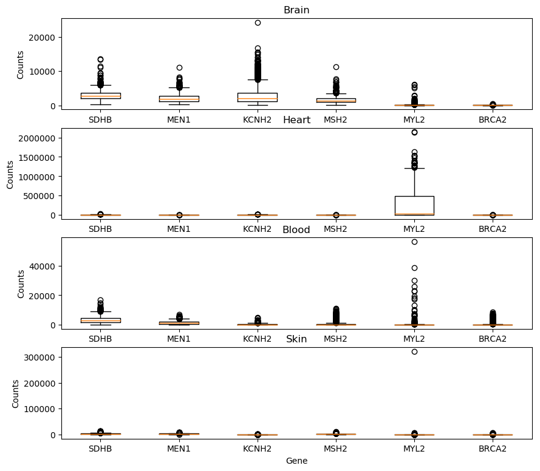

# Workflow with Snakemake
Creating gene data visualization with snakemake python workflow.  Below is an example graph of what is created by this pipeline workflow.



## Modules, Scripts, and Shell File
get_gene_counts.py:  This module pulls out the counts from the sample data given a specific gene.  It's input is "GTEx_Analysis_2017-06-05_v8_RNASeQCv1.1.9_gene_reads.acmg_59.gct.gz" and it's output are the "X_counts.txt" files where the gene name is where the X is.

get_tissue_samples.py:  This module pulls out the IDs from the sample data given a specific tissue type.  It's input is "GTEx_Analysis_v8_Annotations_SampleAttributesDS.txt" and it's output are the "X_sampes.txt" files where the tissue name is where the X is.

box.py: This script relies on get_gene_counts.py get_tissue_samples.py to create the "X_counts.txt" and "X_sampes.txt" files.  It takes these files and creates a series of boxplots depending on the number of tissues and genes specified.

Snakefile: this file runs the pipe line connecting the above 3 python files.  In order to specify the desired genes and tissues, the user must open this file and edit the list of tissues and genes.

hast-tables-rachelbowyer/test_plot_gtex.py: Contains unit tests for the functions in plot_gtex.py

test_func_get_gene_counts.sh: Contains tests of the module get_gene_counts.py

test_get_tissue_sample.sh: Contains tests of the module get_tissue_samples.py

test_box.sh: Contains functional tests of the script box.py

## Running Files

In order to make the shell files executable, run
```
chmod +x test_func_get_gene_counts.sh
chmod +x test_get_tissue_sample.sh
chmod +x test_box.sh
```
then use 
```
./test_func_get_gene_counts.sh
./test_get_tissue_sample.sh
./test_box.sh
```
to run the shell script

## Example

An example of running get_gene_counts.py is 
```
python get_gene_counts.py GTEx_Analysis_2017-06-05_v8_RNASeQCv1.1.9_gene_reads.acmg_59.gct.gz MEN1 MEN1_counts.txt
```
where the user must specify the (1) the data file (2) the gene and (3) the name of the output file

An example of running get_tissue_samples.py is 
```
python get_tissue_samples.py GTEx_Analysis_v8_Annotations_SampleAttributesDS.txt Brain Brain_samples.txt
```
where the user must specify the (1) the data file (2) the tissue and (3) the name of the output file

An example of running box.py is 
```
python box.py -tissues Brain Heart Blood Skin -genes SDHB MEN1 KCNH2 MSH2 MYL2 BRCA2 -out_name Brain-Heart-Blood-Skin_SDHB-MEN1-KCNH2-MSH2-MYL2-BRCA2.png
```
where the user must specify the (1) the desired tissue types (2) the desired genes (3) the name of the output file.  Unlike get_gene_counts.py and get_tissue_samples.py, box.py can support a variable number of tissues and genes.  In order to make sure box.py knows which input is a tissue and which is a gene, the user must type "-tissue" before the tissue entries and "-gene" before the gene entries and so on.
